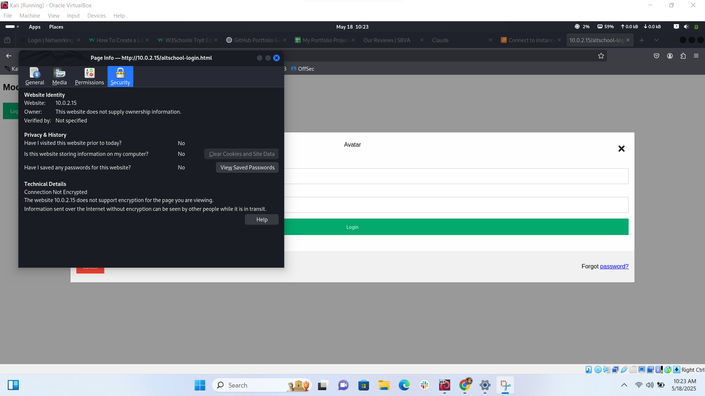
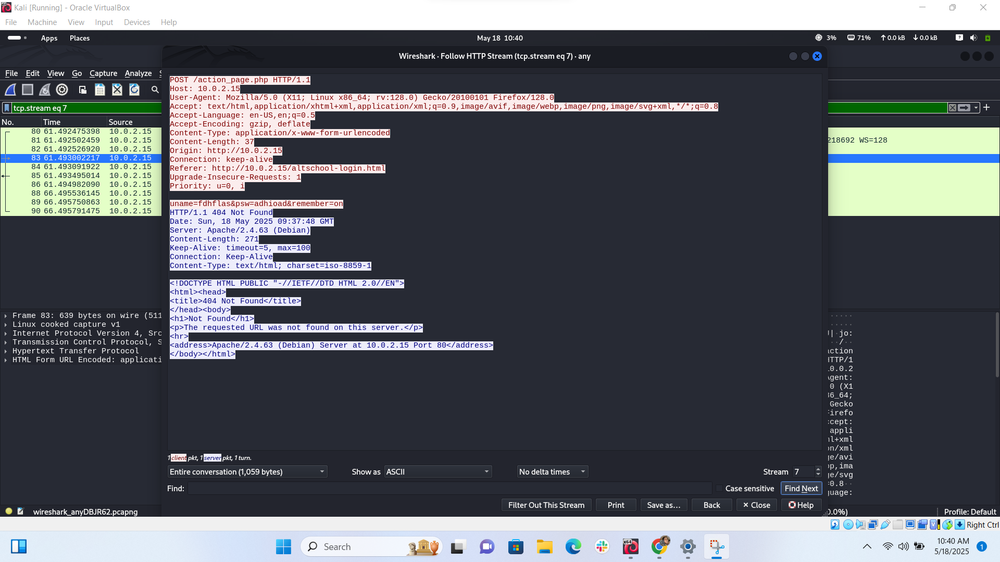
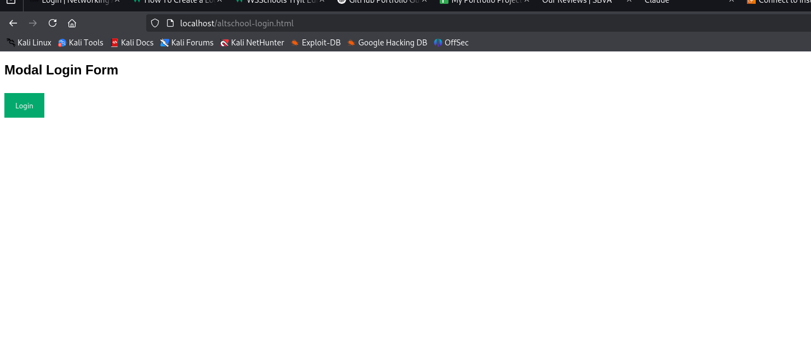
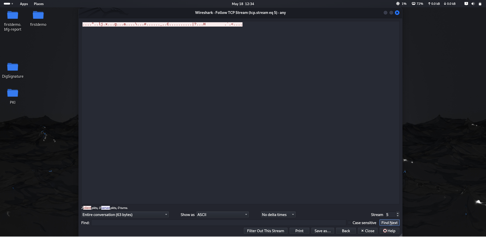

# ssl-encryption-with-apache-and-wireshark
This project demonstrates how to configure SSL/TLS on an Apache web server using a self-signed certificate to secure a sample login page (altschool-login.html). It also includes packet capture and analysis using Wireshark to show the difference in data transmission before and after encryption.
Objectives
Set up a basic HTML login page on Apache.

Configure SSL using a self-signed certificate.

Use Wireshark to inspect HTTP vs HTTPS traffic.

Understand real-time encryption effects.

Learn key security considerations for production use.

## Tools Used
- **Apache** (HTTP server)
- **OpenSSL** (to generate self-signed certificate)
- **Wireshark** (to analyze packet capture)
- **Browser** (to test the login form behavior)

## Project Structure

- `apache-config/`: Contains Apache configuration files with SSL settings.
- `certs/`: Stores the self-signed SSL certificate and private key.
- `screenshots/`: Includes Wireshark screenshots before and after encryption.
- `index.html`: Simple login form for testing encryption.

- ## What I Did

1. Set up a basic login form. (gotten from w3schools)
2. Captured login credentials using Wireshark (unencrypted).
3. Generated a self-signed certificate with OpenSSL.
4. Enabled HTTPS on Apache and reloaded the server.
5. Captured encrypted traffic again with Wireshark.
6. Documented the difference using screenshots.

###  Before SSL Configuration

| Description                      | Screenshot                                      |
|----------------------------------|--------------------------------------------------|
| Browser showing "Not Secure"     | |
| Wireshark capturing plain text   |  |
| Apache SSL config (before edit)  | .png) |

### After SSL Configuration

| Description                      | Screenshot                                      |
|----------------------------------|--------------------------------------------------|
| Apache SSL config (after edit)   | .png) |
| Browser showing "Secure"         |  |
| Wireshark showing encrypted data |  |

## Key Learnings

- HTTPS encrypts data in transit, making it unreadable to attackers.
- Self-signed certificates work for **testing**, but not for **production**.
- Certificates should be renewed every 365 days.
- Always obtain certs from a **trusted Certificate Authority** in real-world use cases.

---

## Security Notes

- **Do not use self-signed certs in production.**
- Keep your private key (`.key`) secure and out of version control.
- Redirect all HTTP traffic to HTTPS for best security practices.
